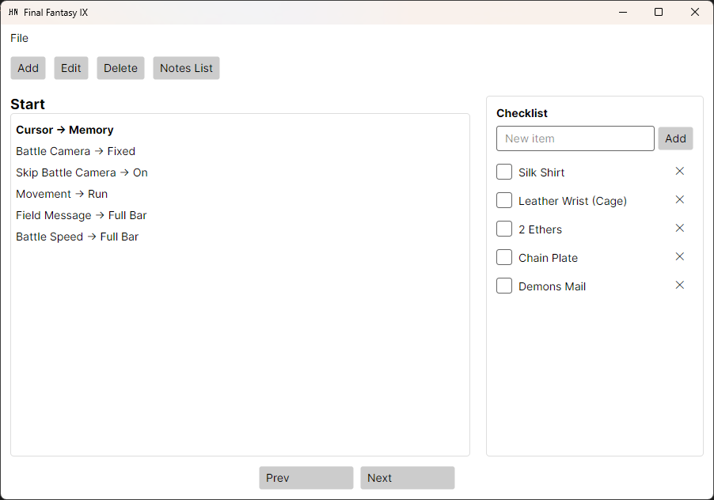
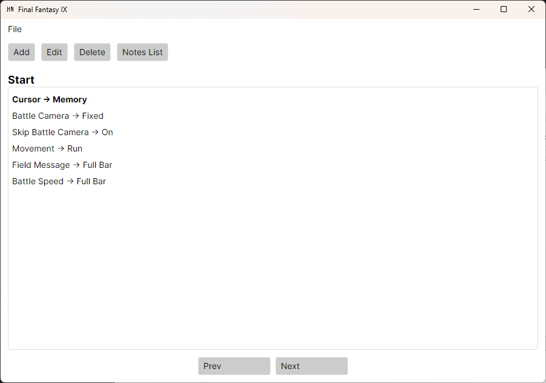
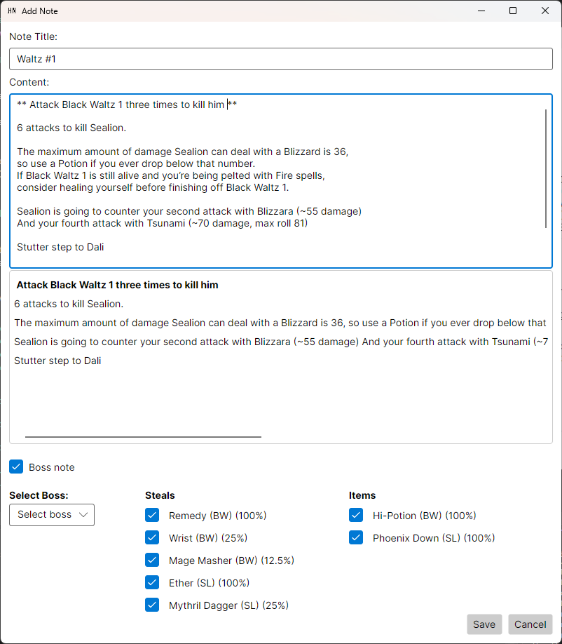
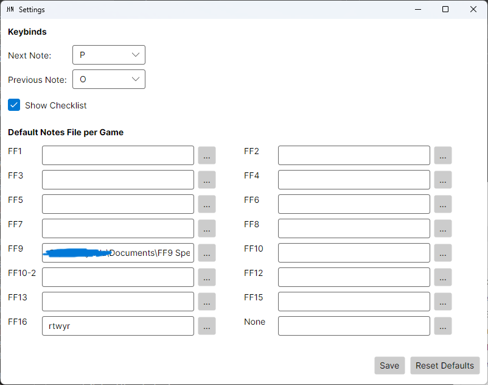
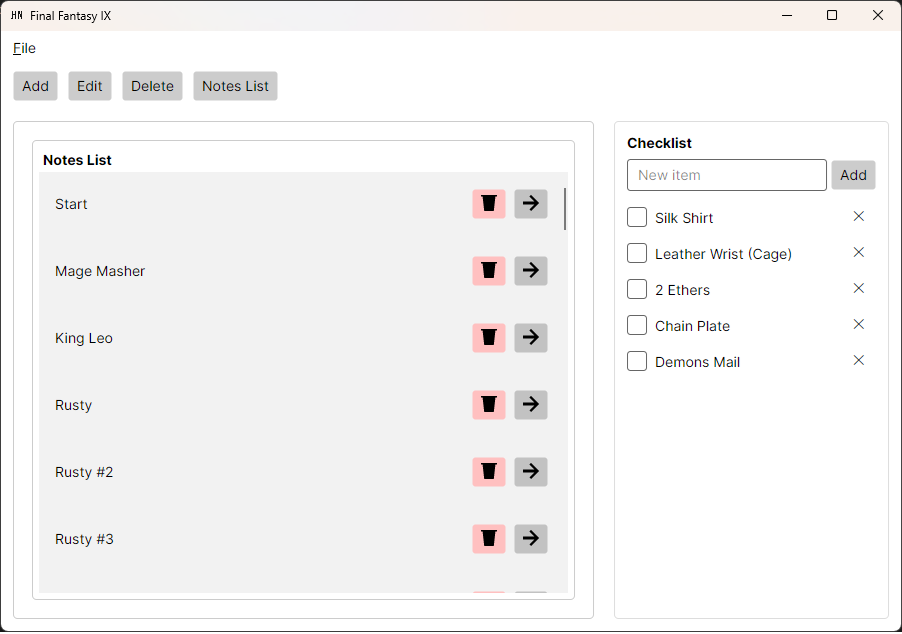

# Haste Notes

Notes app that allows navigating notes without focusing the window with a focus on speed running Final Fanatasy games.

## Description

The whole idea of Haste Notes came from me trying to speed run Final Fantasy IX. Following a google doc was tedious at times.

So I wanted to create an app that would allow me to go through notes while not focusing the window but just playing the game.
It evolved from there and now there are 16 options when selecting a game with bosses from each game/and an option for no game so the app can be general for any game.

## Feathres

* Add/Edit notes
   * Notes are made using markdown (Guide: https://www.markdownguide.org/cheat-sheet) or you can just use plain text
* Delete notes
* Update settings
   * You can update keybinds for next and previous note (Default is O & P)
   * You can turn the checklist on the right on/off
   * Set default notes file for each game
* Drag and drop to reorder notes

## Games

* Final Fantasy I
* Final Fantasy II
* Final Fantasy III
* Final Fantasy IV
* Final Fantasy V
* Final Fantasy VI
* Final Fantasy VII
* Final Fantasy VII
* Final Fantasy VIII
* Final Fantasy IX
* Final Fantasy X
* Final Fantasy XII
* Final Fantasy XIII
* Final Fantasy XV
* Final Fantasy XVI

You can select from these gamnes and when adding a new note you'll have the option to choose from bosses in that game.

### Screenshots

```
Game selection screen
```


```
Notes window with a checklist and without
```




```
Add/Edit note (with boss info)
```



```
Settings (file gets stored in %AppData/HasteNotes%)
```


```
Notes List (you can drag and drop these)
```


## Disclaimer

I gathered the data for the boss information through different wikis and guides so not sure what versions everything is for (especially pre FF7)

This app will also only work on windows as it uses MouseKeyHook 5.7.1 to let you navigate notes without focusing the window
It might run fine on other OS's but without th keybinds working but not entirely sure

## Features to add

* Custom boss information
* Search to boss dropdown
* A proper rich text editor

## Version History

* 1.0
    * Initial Release
